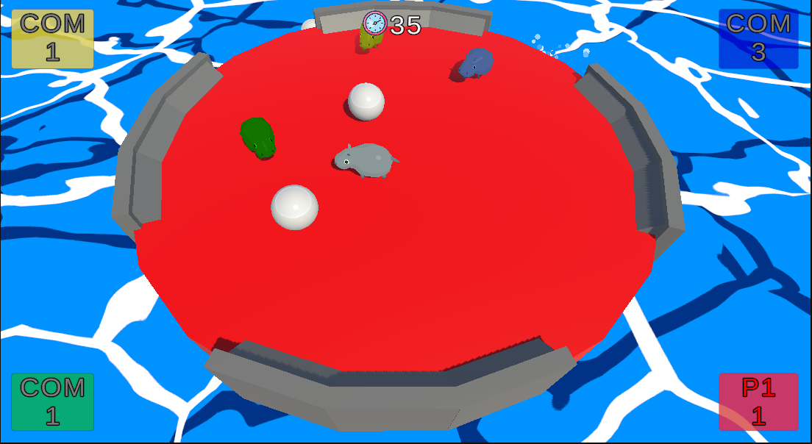

<html>
    
</html>

    Greetings, and welcome to my site! 
    This site was created with Github Pages and Jekyll. 
    You can see the repository for this site by clicking the "View on GitHub" button above!
      
    Below is a compilation of projects I have completed and some I am currently working on.
      
    Contact info: 
    ekramer567@gmail.com 
    LinkedIn: <a href="https://www.linkedin.com/in/ekramer567">www.linkedin.com/in/ekramer567</a>
    

    <h1>Hippo Soccer Royale</h1>
     
<a href="/assets/unity/HippoRoyale_Build/index.html" class="button">Play</a>

 

    Hippo Soccer Royale (working title) is a work-in-progress that I'm actively working on (quite possibly as you're reading this). It is a whimsical little minigame loosely inspired by the classic tabletop game "Hungry Hungry Hippos", except the player is a cute tiny hippo knocking marbles into their goal while preventing others from scoring in theirs. 
	I plan to add Menus, UI, AI computer players, a highscores board, and a lot of polish (in the form of asset store props, particle effects, sound, and shader effects).  
	Making this playable in a browser window required building it in WebGL form and pushing the build to the repository for this site. You can find this project on my github here: 
    <a href="https://github.com/EKramer567/HippoSoccerRoyale">Hippo Royale Repository</a> 
	WASD to control, or it should work with a controller (does not yet work on mobile)

---
---

    <h1>Quadcopter Simulator</h1>
     
<a href="/assets/unity/Quadcoptersim/index.html" class="button">Play</a>

 

    This is my attempt at a quadcopter simulator. I made this with Unity using C#, and no plugins or asset store assets. Making this playable in a browser window required building it in WebGL form and pushing the build to the repository for this site. You can find this project on my github here: 
    <a href="https://github.com/EKramer567/Quadcopter-Simulator">Quadcopter Simulator Repository</a>  
                                                   
I made this several years ago, but I may come back to this project at a later date to clean it up and polish it. 

  
---
---

    <h1>Hero Landing!</h1>
     
<a href="https://play.google.com/store/apps/details?id=com.EKramer.HeroEntranceTraining" class="button">Go to Google Play Page</a>

 

<i>Hero Landing!</i> is a small mobile game that I completed and published to the Google Play Store myself. I made this with Unity using C#. I used plugins for ads and microtransactions, and SFX/Music from the asset store. I chose to keep its repository private, since it is a monetized published game. If you'd like to see some snippets of the code that went in to <i>Hero Landing!</i>, please email me and I can get those for you.
Note, this is an old project of mine that has since fallen off the app store. I do still have the project and I could put it back up (I still have the game on my phone, actually), but I'm prioritizing newer projects at the moment.

  
---
---
