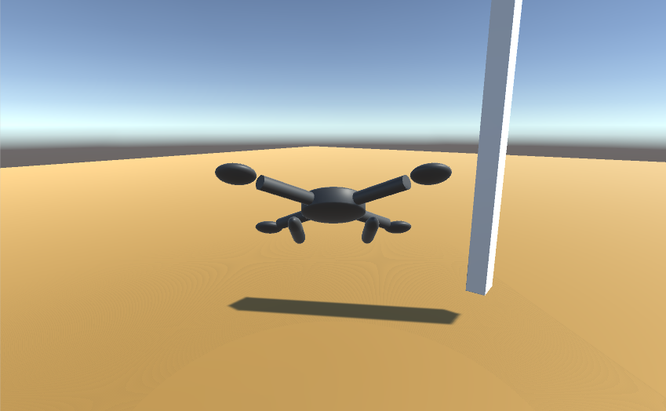
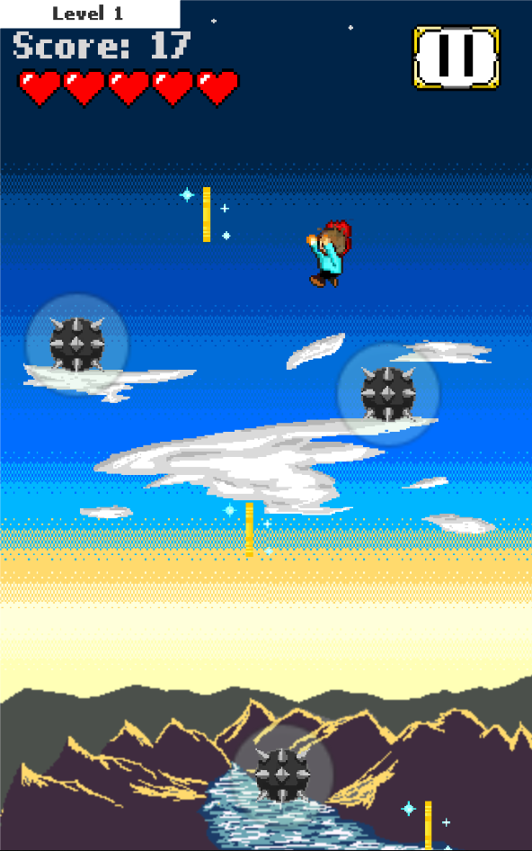

    Greetings, and welcome to my site! 
    Below is a compilation of projects I have completed and some I am currently working on.
      
    Contact info: 
    ekramer567@gmail.com 
    LinkedIn: www.linkedin.com/in/ekramer567
    

<html>
    
</html>
---

    <h1>Quadcopter Simulator</h1>
     
<a href="/assets/unity/Quadcoptersim/index.html" class="button">Play</a>

 

    This is my attempt at a quadcopter simulator, using a USB/Bluetooth controller. At the moment, you can only control the copter with the USB controller, but for the moment I just want to get this up here. You can find the project on my github here: 
    <a href="https://github.com/EKramer567/Quadcopter-Simulator">LINK</a>  
                                                   
Before I move on to my next project, I'm going to add keyboard controls for the sake of this site, and I want to fix one bug that I've been trying to fix forever: if the copter's Yaw goes near 180 degrees relative to its starting rotation, <i>the PID balancing makes the copter flip out unexpectedly</i>. I think I will also mess around with the terrain tool and maybe get some free tree assets to put in there just to make it look a bit better. Eventually I want to figure out how to allow the use of WebVR on these pages.

  
---
---

    <h1>Hero Landing!</h1> 
     
<a href="https://play.google.com/store/apps/details?id=com.EKramer.HeroEntranceTraining" class="button">Google Play</a>

 

<i>Hero Landing!</i> is a small mobile game that I completed and published to the Google Play Store myself, which you can install and play on an Android phone. I chose to keep its repository private, since it is a monetized published game. If you'd like to see some snippets of the code that went in to <i>Hero Landing!</i>, please email me and I can get those for you.

  
---
---
